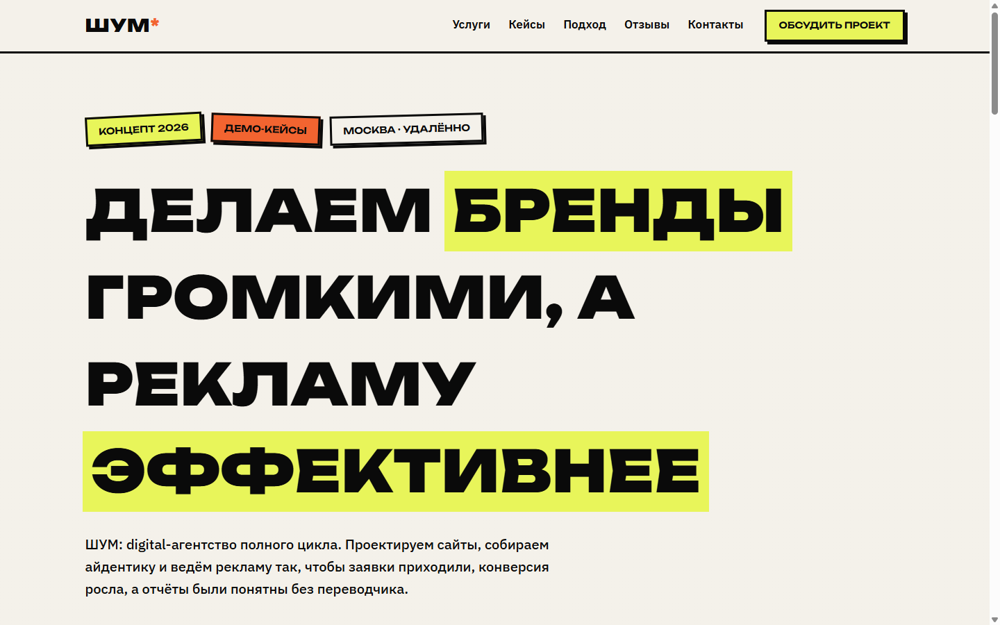

# ШУМ* — лендинг digital-агентства

Одностраничный сайт вымышленного digital-агентства «ШУМ*»: сайты, брендинг, performance. Концепт для портфолио на чистых HTML, CSS и JavaScript — без фреймворков и сборки. Дизайн — нео-брутализм: толстые чёрные рамки, жёсткие offset-тени без блюра, кислотная заливка, маркер-акценты в заголовках.



## Что внутри

- нео-бруталистский UI-кит: кнопки с жёсткими тенями и продавливанием при нажатии, повёрнутые стикеры, ключевые слова в заголовке выделены кислотной заливкой;
- бесконечная бегущая строка с услугами на чистом CSS, без единой строки JS;
- аккордеон услуг: нумерованные строки, инверсия цвета на hover, открыта одна за раз, анимация высоты;
- сетка кейсов с цифрами результата (+140% заявок, −38% CPL), тень уезжает при наведении;
- счётчики (7 лет, 120+ проектов, 94% возвращаются) заводятся на скролле через IntersectionObserver; entrance-анимации резкие, на translate, без медленных фейдов;
- форма заявки: валидация имени и телефона/email, ошибки inline, success-состояние;
- бургер-меню ниже 920px, сетки на мобильных складываются в одну колонку;
- доступность и SEO: `aria-expanded` на аккордеоне и бургере, `aria-live` для ошибок, видимый фокус, `prefers-reduced-motion`, Open Graph, SVG-favicon.

## Как посмотреть

Можно просто открыть `index.html` двойным кликом — зависимостей нет. Или поднять локальный сервер:

```powershell
# PowerShell
cd shum-agency
python -m http.server 8080
# открой http://localhost:8080
```

## Честно об ограничениях

- Форма заявки не отправляет данные никуда: проверки и success-сообщение живут только на клиенте.
- Кейсы, цифры и метрики придуманы для макета.
- Фотографий нет вообще — вся графика нарисована CSS, поэтому страница весит мало.

## Структура файлов

```
shum-agency/
├── index.html        # одна страница, все секции
├── css/style.css     # дизайн-система, компоненты, адаптив
├── js/main.js        # меню, аккордеон, счётчики, reveal, валидация формы
├── favicon.svg
├── screenshots/      # desktop.png, mobile.png
└── README.md
```

## Палитра и шрифты

| Токен | Значение | Где используется |
| ----- | -------- | ---------------- |
| Acid  | `#D9FF3D` | основной акцент, заливки |
| Ink   | `#0A0A0A` | рамки, текст, тени |
| Paper | `#F4F1EA` | фон |
| Hot   | `#FF5C39` | второй акцент |

Шрифты с Google Fonts, кириллица есть: Unbounded для заголовков, IBM Plex Sans для текста.

## Стек

HTML5, CSS (custom properties, grid), ванильный JavaScript; внешняя зависимость — только Google Fonts.

## English summary

One-page site for SHUM*, a fictional digital agency. Neo-brutalist portfolio concept in vanilla HTML/CSS/JS, no build step. CSS marquee, services accordion, cases with result metrics, scroll counters, validated lead form, burger menu below 920px. The form is client-side only; all content is demo.
